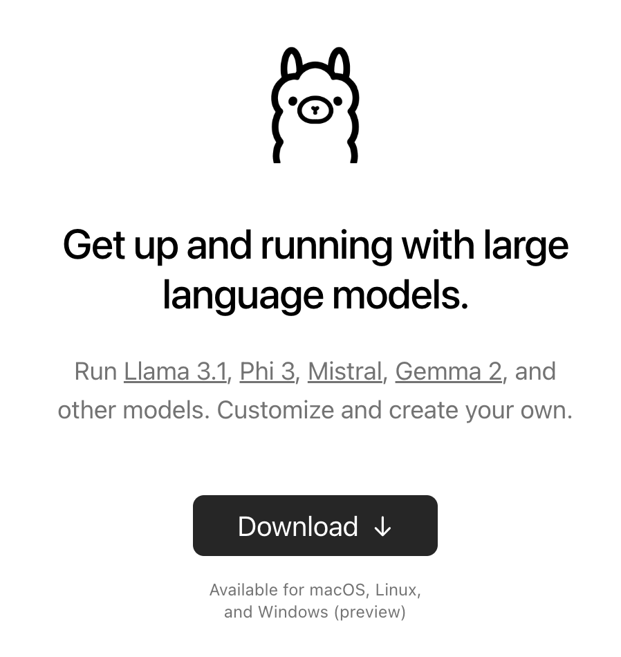

Simple Retrieval Augmented Generation using Langchain, llama3.1 embeddings + chat pulled using Ollama, and Chroma db to store embeddings. 
Allows me to split and embed pdf documents and draw chunks of them to use as context in repsonses to user queries.

The goal for RAG is to be able to retrieve documents or other informative objects that are directly related to a user query and feed them into the context window of the language model being used.
For this project, we are able to import pdfs of our choosing into a folder, embed them into a vector-store, and retrieve document chunks that correlate closest to a user query, improving accuracy and speed.

Using Mac.

--

# Quick Run

My preference is to begin by creating a virtual environment for all of my installations and packages. If you would like, install Conda. 
Once you've done this, to work within a new virtual conda environment for you to work in, type the following into your command prompt, one line at a time:

```bash
# to create:
conda create -n your_env_name.env
# to activate:
conda activate your_env_name.env
# to deactive
conda deactivate
# to remove (after deactivating)
conda remove -n your_env_name.env --all
```

## If not using a virtual env, start here.

Install the "onnxruntime" dependency for chromdb:

```bash
conda install onnxruntime -c conda-forge
```

Then, create a text file called requirements.txt in your project folder and paste the contents of my requirements file into yours. 
I chose to specify exact package versions that worked for me, but you may have to update versions in the future.

To install the dependencies listed in the requirements file, type the following into your command line.

```bash
pip install -r requirements.txt
```
We're off to a great start. We're getting set up. Next, we want to install Ollama, a platform for using the amazing open-source models that are now available to the public.



After downloading this, I recommend pulling llama3.1, a very capable open-source model by today's standards. Command prompt:

```bash
Ollama pull llama3.1
```
This will take some time.  

While that's busy working (I believe it's downloading the model weights, but I'm not quite sure), look for some pdf documents that you'd like to retreive from. 
I'd recommend using very short ones for testing, perhaps only a few words in a single google doc, downloaded as a pdf. Add this/these into a "data" folder within your project folder.

---

Once llama3.1 has been successfully pulled, you can try and create your document embeddings by running: 

```bash
python database.py
```
This will create a Chroma database, load the documents, split them, and finally embed those "chunks" as vectors into the high-dimensional space of the vector-store database. This may take some time.

---

Once this has been completed, you can now query the database! 

```bash
python query.py "Type your query here!"
```

Your query will be matched with document chucks from the database that contain words most closely resembling the context of your query. 
That way, the hope is that more accuracy, speed, and helpfulness will be achieved.

Here's what the prompt will look like from the eyes of the language model, where {context} is related document chunks, and {question} is the user query:

```python
PROMPT_TEMPLATE = """
Answer the question based on the following context:

{context}

---

Answer this question based on the above context: {question}
"""
```

---

The goal for the future of this project is to be able to feed more interesting things into llama's context window (i.e. live voice transcription, environmental context from vision, etc.).
I believe this would make language models even more useful, as they can pick up context from the environment by themselves rather than needing to be explained everything.

## Don't want to chat with llama3.1 ?

That's fine! There are plenty of other models available through Ollama.

Instead of llama3.1:

```python
model = Ollama(model="llama3.1")
    response_text = model.invoke(prompt)
```

You can use Gemma2:

```python
model = Ollama(model="Gemma2")
    response_text = model.invoke(prompt)
```

Or Mistral
```python
model = Ollama(model="Mistral")
    response_text = model.invoke(prompt)
```

## Enjoy ;)
